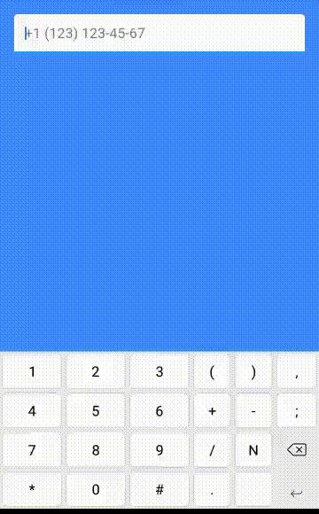

# mask_text_input_formatter

[](https://pub.dartlang.org/packages/mask_text_input_formatter) [](https://travis-ci.com/siqwin/mask_text_input_formatter)  [](https://codecov.io/gh/siqwin/mask_text_input_formatter) 

Masked text input formatter for flutter.


## Example



## Usage

Follow install guide:

https://pub.dartlang.org/packages/mask_text_input_formatter#-installing-tab-

Import the library:

```dart
import 'package:mask_text_input_formatter/mask_text_input_formatter.dart';
```

Create mask formatter:

```dart
var maskFormatter = new MaskTextInputFormatter(mask: '+# (###) ###-##-##', filter: { "#": RegExp(r'[0-9]') });
```

Set it to text field:

```dart
TextField(inputFormatters: [maskFormatter])
```

## Change the mask

You can use the `updateMask` method to change the mask after the formatter was created:

```dart
var textEditingController = TextEditingController(text: "12345678");
var maskFormatter = new MaskTextInputFormatter(mask: '####-####', filter: { "#": RegExp(r'[0-9]') });

TextField(controller: textEditingController, inputFormatters: [maskFormatter])  // -> "1234-5678"

textEditingController.value = maskFormatter.updateMask("##-##-##-##"); // -> "12-34-56-78"
```
